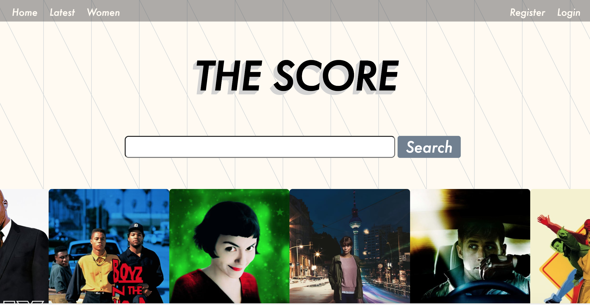
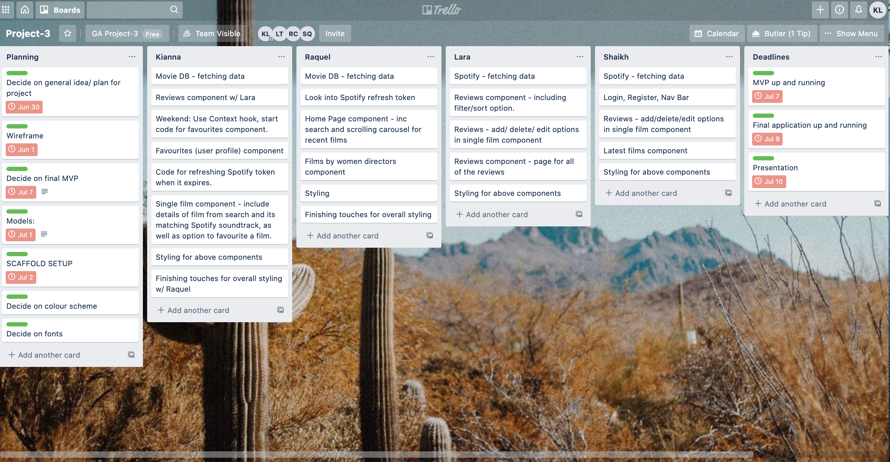
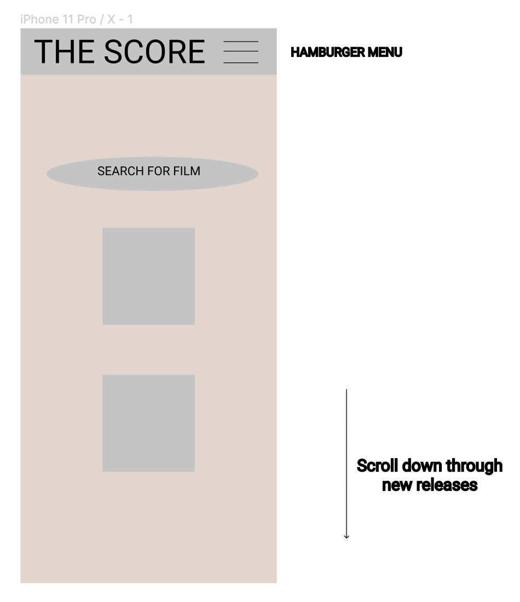
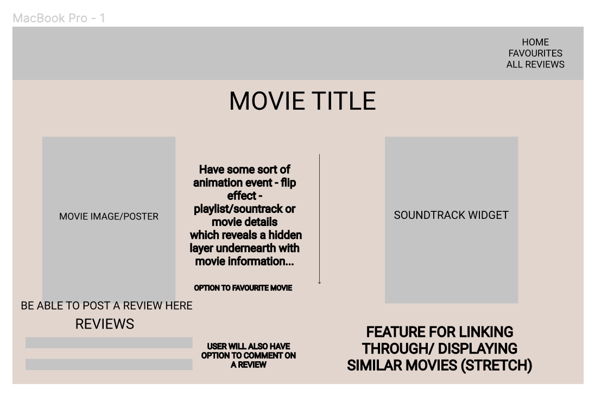
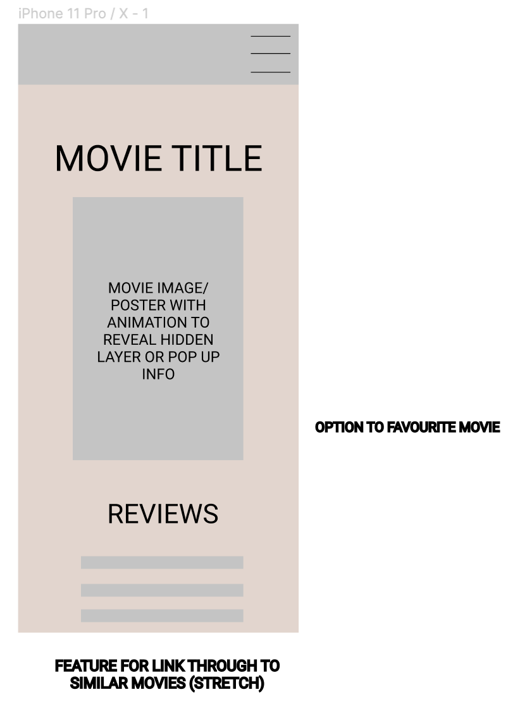
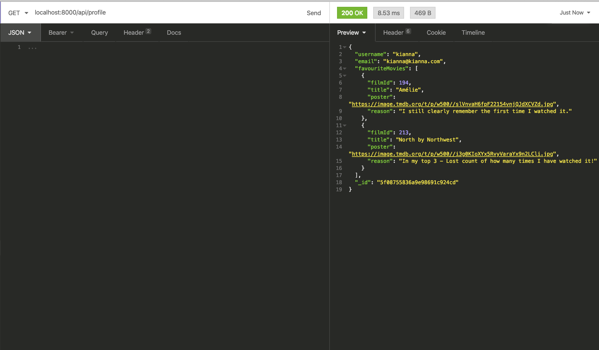

# Project 3 - The Score
By [Kianna Love](https://github.com/akirakianna), [Raquel Cruickshank](https://github.com/cruickshankprc), [Lara Thompson](https://github.com/larathompson) and [Shaikh Qayum](https://github.com/shaikhqayum)

## Overview

This was my first group project at General Assembly.
I worked within a team of four to create a full-stack MERN application over 8 days, which implemented an Express API.

The Score is an application that allows users to search for a movie and will return the movie information as well as it's associated soundtrack/ playlist from Spotify.



The user can browse without registering, but they also have the option to create an account — at which point they have access to extra features such as being able to leave reviews and add films to their personal favourites page.

You can find a link to our deployed version [here](https://the-score.herokuapp.com/#/)


## Table of Contents
1. [Brief](#Project-Brief)
2. [Technologies used](#Technologies-Used)
3. [Approach](#Approach)
    - [Planning](#Planning)
    - [Back-end](#Back-end)
    - [A Journey](#A-Journey)
    - [Front-end](#Front-end)
- [Challenges and Lessons Learned](#Challenges-and-Lessons-Learned)
- [Victories](Victories)
- [Future Features and Improvements](#Future-Features-and-Improvements)
- [Credit](#Credit) 
    

## Project Brief

* Work in a team, using **git to code collaboratively**.
* **Build a full-stack application** by making your own backend and your own frontend.
* **Use an Express API** to serve your data from a Mongo database.
* **Consume your API** with a frontend built with React.
* **Be a complete product** which most likely means multiple relationships and CRUD functionality for at least a couple of models.
* **Implement thoughtful user stories/wireframes**.
* **Have a visually impressive design**.
* **Be deployed online**.


## Technologies Used

* HTML
* CSS/SASS
* JavaScript
* React.js
* React Hooks
* Node.js
* Express
* Spotify API
* MovieDB API
* MongoDB and Mongoose
* Git and GitHub
* Insomnia
* JWT
* Axios
* Bcrypt for Node.js


## Approach

### Planning

We began our project by a general discussion of our ideas and how we could best combine them into an application that we would all be interested in working on?

Our goup had quite a strong interest in music and we had initial thoughts about trying to create a webplayer which would pull tracks from several different music related APIs, before we came to the idea of a soundtrack application which would combine a film API with a music API to return an application where you could search any film and it would return the associated soundtrack or playlist.

For this task we chose [The Movie DB](https://developers.themoviedb.org/3) and [Spotify](https://developer.spotify.com/documentation/web-api/)

#### MVP

Our first goal to work toward was our MVP, so we planned out what we would ideally like to have in the initial working version of our application:

- Homepage
   - Search Bar (main feature)
   - Carousel of posters from films (pick a category from film API)

- Nav Bar
   - Not logged in: Home, Register, Login, Latest, Women
   - Logged in: Home, Latest, Women, Favourites, Reviews, Logout


- Single Film Page
   - Film title and synopsis
   - Movie poster
   - Related Spotify soundtrack
   - Reviews (add, edit, delete)
   - Option to favourite

- Favourites
  - Cards of user's favourited films 

- Reviews
   - All reviews left by users of the site

- Stretch
   - Similar films (posters) displayed on single film page
   - Additional pages (latest, women directors)
   - Be able to comment on another user's review

#### Figma and Trello

I took the lead for managing and organising our project by setting up a Trello board and creating simple wireframes of our chosen design/layout using Figma.




**! Please note this is only a selection the wireframes:**






### Back-end
During the build, we employed the following back-end technologies: MongoDB, Mongoose, Express and Node.js.

#### Schemata
We created two schemata for our application — one for the user and one for the film reviews which would be associated with a specific user.

```js
const schema = new mongoose.Schema({
  username: { type: String, required: true, unique: true },
  email: { type: String, required: true, minLength: 8, unique: true },
  password: { type: String, required: true },
  favouriteMovies: { type: [Object] }
})
```
The user schema includes a favourite movies field, which will store any films the user decides to favourite when using our application. 

We also used the bcrypt library within this model to hash the user's password. Our password confirmation is stored in a virtual field and is checked against the password the user enters before validation.


```js
const reviewSchema = new mongoose.Schema({
  text: { type: String, required: true },
  user: { type: mongoose.Schema.ObjectId, ref: 'User', required: true },
  rating: { type: Number, required: true },
  filmId: { type: String, required: true },
  film: { type: Object },
  comments: [ commentSchema ]
}, {
  timestamps: true
})
```

As a stretch goal we wanted to have the option of commenting on a review so we created a comments schema that would then be tied to our review schema. However we did not get around to implementing this on the front-end.

####API Endpoints

* User
  - /register - **POST**
   - *A user can register for an account and their data is stored in our database.*
  - /login - **POST**
   - *A user can also log in to their account, at which point the submitted data is checked. If it's valid (exists in our db), a token is returned.*

* Reviews
 - /reviews - **GET**, **POST**
   - *The post route here was intially for testing purposes and is not utilised on the front-end. The get route allows us to return all of the reviews posted on the site.*
 - /review/:id - **GET**, **DELETE**, **PUT**
  - *The user has the option to return, edit or delete a specific review by its id.*
 - /movie/reviews/:filmId - **GET**, **POST**
   - *Returns all of the reviews for a specific film. The user can also post a review of this film using this route.*

* Profile
 - /profile - **GET**
  - *The user's profile (shown on our front-end as the favourites page) - returns the current user's information (username, email, id) as well as a list of all of the films they have favourited.*
 
  

* Favourites
 - /favourites - **POST**
  - *Option to post (or save) a favourite film - It takes the film title, post and id and saves them to the user's favouriteMovies array. On the front-end this is done by the user clicking a favourite button.*
 - /favourites/:filmId - **DELETE**
  - *User has the option to remove a film from their favourites list - will delete the film and it's data from the favouriteMovies array.*
 
### A Journey 
*From front-end to back-end and back again!*

#### Favourites 

On any single film page, a logged in user has the option to favourite a film.

Once the button is clicked, a post request is made to the API endpoint (along with the data from that particular film) that is listed in our application's router:

```js
 const data = {
      filmId: movieData.id,
      title: movieData.title,
      poster: `https://image.tmdb.org/t/p/w500/${movieData.poster_path}`,
      reason: reason
    }
    axios.post('/api/favourites', data, {
      headers: { Authorization: `Bearer ${Auth.getToken()}` }
    })
```

```js
router.route('/favourites')
  .post(secureRoute, userController.addFavourite)
```

This then actions the specified function in our user controller:

```js
function addFavourite(req, res) {
  const favourite = req.body
  User
    .findById(req.currentUser)
    .then(user => {
      user.favouriteMovies.push(favourite)
      return user.save()
    })

    .then(user => res.status(201).json(user))
    .catch(err => res.status(401).send(err))
}
```

This function requests the current user (able to do this as it is a secure route and the user will exist in the database) and pushes the favourited film to the favourite movie key on the user object.
It then saves/updates the user with the new information.

I was then able to display any user's favourited films on their favourites(profile) page.

As a couple of additional features I wrapped a ternary operator around the favourite button which checks if the film has been favourited before or not, if it has it disables the button so the user cannot add it again:

```js
{added ? <button title="Disabled button" disabled>Added</button> : <button className="favouriteMovieButton" onClick={favourite}>Favourite</button>}
```

I also created an additonal step where the user has the option to submit a reason as to why it is their favourite film, which is added as a key to the user object when the post request is made. This then displays alongside the other data on the favourites page:


### Front-end

##### useContext Hook

I utilised the useContext Hook in our project - something that was not taught on our course. It allowed me to store the Spotify token and the current user's information globally in state - meaning their data can be easily shared/accessed across our app's components without having to pass them down through every component as props.

I created two instances of context - UserContext and SpotifyContext:

```js
import { createContext } from 'react'

export const UserContext = createContext(null)
export const SpotifyContext = createContext(null)
```

I then imported these into our App.js file and used a provider (provides the context) to wrap them around the components that would need access to them:

```js
<UserContext.Provider value={{ userInfo, setUserInfo }}>
        <SpotifyContext.Provider value={{ spotifyInfo, setSpotifyInfo }}>
          <Route exact path="/" component={HomePage} />
          <Route exact path="/reviews" component={Reviews} />
          <Route path="/register" component={Register} />
          <Route path="/login" component={Login} />
          <Route path='/movie/:name/:id' component={SingleMovie} />
          <Route path="/profile" component={Favourites} />
          <Route path="/latest" component={Latest} />
          <Route path="/women" component={WomenMovies} />
        </SpotifyContext.Provider>
      </UserContext.Provider>
```

On reflection, it would have been better to split them out into their own files, as I wouldn't have had to list the values in our App.js file - which would have made it more readable.

##### Spotify 

We used Spotify's Client Credentials Flow authorization option as it enabled us to display Spotify data on our app without having the user log into a Spotify account. 
Using their search by query endpoint we were able to return soundtrack playlists by entering the film name and soundtrack:

 - Example Insomnia Call
    -  https://api.spotify.com/v1/search?q=ema soundtrack&type=playlist


We used a template literal in our API calls to match the Movie DB query with the Spotify query so that the matching film and soundtrack data would be returned:

```js
axios.get(`https://api.themoviedb.org/3/search/movie?api_key=${API_KEY}&language=en-US&query=${movieName}&page=1&include_adult=false
    `)
      .then(axiosResp => {
        setMovieData(axiosResp.data.results[0])
        if (userInfo) {
          //! Kianna  - this code is checking to see whether the specified movie already exists inside of the favouriteMovies array
          //! .some() returns a boolean value, used for ternary operator for add to favourites button.
          const exists = userInfo.favouriteMovies.some(movie => movie.filmId === axiosResp.data.results[0].id)
          setAdded(exists)
        }
      })
      .catch(err => console.log(err.response))
```

```js
 axios.get(`https://api.spotify.com/v1/search?q=${movieName}soundtrack&type=playlist`,
      {
        headers: { 'Authorization': `Bearer ${spotifyInfo}` }
      })
      .then(axiosResp => {
        setTimeout(() => {
          setSoundtrackData(axiosResp.data.playlists.items[0].id)
          console.log('hello')
        }, 150)
      })
      .catch(err => console.log(err.response))
 
```
 
One of the restrictions with the spotify authorization token was that it expired every hour. To fix this I created a post request within a function:


```js
function refreshToken() {
    
    axios.post('https://accounts.spotify.com/api/token', queryString.stringify({ 'grant_type': 'client_credentials' }), {
      headers: {
        'Content-Type': 'application/x-www-form-urlencoded',
        'Authorization': `Basic ${SPOTIFY_AUTH}`
      }
    })
      .then(res => {
        console.log('token refreshed')
        setSpotifyInfo(res.data.access_token)
      })
      .catch(res => {
        console.log(res)
      })
  }
```

This function is then called inside of a setInterval function which is inside of the useEffect hook in the App component.


## Challenges and Lessons Learned

* This was our first project where we coded collaboratively using Git - allowing us to understand the complexities of merging and conflict resolution. Working as a team with Git was challenging and we realised that when our communication broke down we ended up with numerous conflicts.
However, we were able to quickly minimise the conflicts by having daily rounds of git commits and merging our versionsof the project. Each team member would screen share when it was their turn to commit and merge - this meant that if there were any conflicts (or other git related issues) we could resolve them as a team.
* Back-end vs Front-end - Initially we couldn't decide  whether we should store the film information in our own db or make the API calls on the front end. We ended up deciding that it would be better to store minimal data and make the calls on the front-end. This also means our app stays up to date with the MovieDB information.
* Refactoring our code - There are components in our project that we should have split out into smaller components - e.g the SingleMovie component as there were often multiple people were working on it at once (has most of the main functionality). It also would have made our code easier to read, as right now there far too much going on in one file.
* Styling - similarily to the above, something that would have potentially helped us would have been to use styled components so we could have split our project's styling out.

## Victories

* Team work - this was my first time coding collaboratively with more than one person. Though challenging at points, it was overall an incredibly valuable experience as I learnt how to work as part of a team whilst building a full-stack application across lots of components. We quickly found a pattern of working which worked for our group. This included sometimes splitting into pairs (and pair programming) to work on sections, some solo work and some parts working together as a whole team - this was mostly during the setup/while we tried to get our public APIs working.

## Future Features and Improvements

* Write the extra code to allow the user to **comment** on another user's review. We have the Schema and routes set up in the back-end but haven't implemented them in the front-end.
* Our styling needs some adjusting to make it fully responsive.
* DRY code - a lot of refactoring needs to be done.

## Credit

Background SVG art created on [Hero Patterns](https://www.heropatterns.com/)


